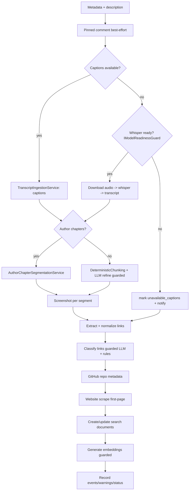
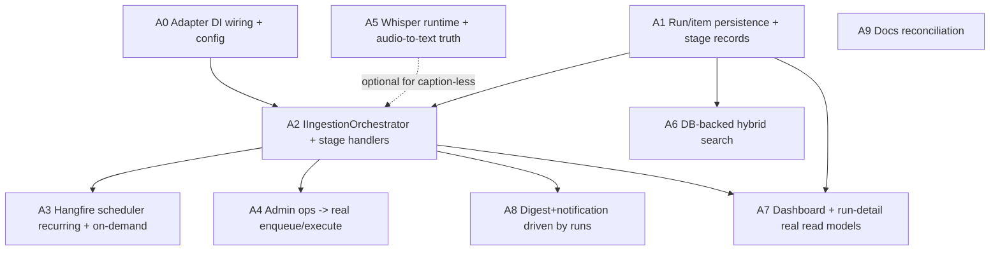

# Application Truth Implementation Plan

This plan closes the gap between what Streaming Digest **claims** (PRD `docs/product/PRD.md`, ARCHITECTURE `docs/architecture/ARCHITECTURE.md`) and what it **does** today. It is a peer to `model-download-implementation-plan.prompt.md` (model acquisition/lifecycle) and `model-download-implementation.prompt.md` (summary). Read all three. Where the model plan and this plan overlap on model readiness, the model plan owns acquisition/verify and exposes `IModelReadinessGuard`; this plan consumes that guard.

Develop this on a **new branch off current `main`** (for example `feat/application-truth`). Do not build on any in-progress refactor branch.

> **Central finding:** The write/index/persistence layer is largely real. The *orchestration that populates it* and the *read surfaces that display it* are stubs/fixtures. This is overwhelmingly a **wiring** problem, not a build-from-scratch problem. Treat existing services as the parts list; the primary new code is the orchestrator, the scheduler, and the real read paths.

---

## 1. Problem Statement (Ground Truth — from a code-level audit)

The following are **confirmed by reading the code**, not inferred:

### 1.1 There is no live ingestion pipeline (highest severity)

- `Worker.ExecuteAsync` (`src/StreamingDigest.Worker/Worker.cs`) only: dispatches outbox notifications every 5s, runs retention cleanup hourly, and optionally generates **one** screenshot if config paths are set. There is **no channel polling, no video discovery, no transcription/segment/embedding loop**, and **no** `RecurringJob`/`BackgroundJob.Enqueue` anywhere in the worker.
- The YouTube metadata adapters (`YouTubeApiMetadataAdapter`, `YtDlpMetadataAdapter`) are **not registered in DI and never invoked**. Nothing discovers videos from channels.
- `AdminOperationsService.RunIngestionNowAsync` / `RunChannelBackfillAsync` return an `"accepted"` result and write an `ingestion_runs` row, but **never enqueue or execute** real work. The run list then shows runs that did nothing.
- The only reachable real ingestion path — `TranscriptIngestionService.IngestAsync` — is called **only** from `ReprocessVideoAsync`/`RetryFailedVideoAsync`, i.e. only for a video that already exists. Nothing creates videos in the first place.

### 1.2 Read surfaces are fixture-backed, not real data

- **Search does not search your videos.** `SearchUiService` is registered as a singleton whose every constructor path loads `SearchUiCorpusCatalog.CreateDefaultFixtureCorpus()`. `/api/search-ui/search` ranks over that in-memory catalog. The real pgvector stores (`PostgresSearchDocumentEmbeddingStore`, `PostgresVideoClusterEmbeddingStore`, with a real HNSW index) exist but are never queried by the search UI.
- **Dashboard is canned.** `Home.razor` renders `DashboardSummaryService.GetSummary(...)` — hardcoded client-side fixtures.
- **Ingestion-run detail is fixture-only.** `IngestionRunDetailFixtureService` is the only registered source; it is keyed by `fixture-regular`/`fixture-deferments`/`fixture-completed` and throws on unknown ids, while the list links real GUIDs.

### 1.3 Real code paths that silently produce nothing / fake health checks

- **Audio-to-text is a no-op in every configuration.** `StubAudioToTextProvider` returns empty; `LocalWhisperAudioToTextProvider` returns empty when `BaseAddress` is null — and there is **no whisper service in the AppHost**, so it is always unconfigured. Any transcription of a caption-less video yields empty text.
- **Two admin "test" operations don't test anything.** `TestMatrixNotificationAsync` returns `"completed"` without sending; `TestAudioToTextServiceAsync` returns `"completed"` without probing. (`TestEmbeddingServiceAsync` **is** real.)

### 1.4 Documentation/architecture fidelity

- **Model download/verify are fake** — owned by `model-download-implementation-plan.prompt.md`.
- **Semantic Kernel is documented but unused** — owned by Section 12 of the model plan (MEAI/SK inference migration).

### 1.5 What is already real (calibration — do NOT rebuild)

- HNSW vector index: `002_search_indexes_and_views.sql` creates `USING hnsw (embedding_vector vector_cosine_ops)`.
- Embedding + search + cluster stores (pgvector `<=>`), `SearchDocumentRegenerationService`, recent-search embedding (`PostgresRecentSearchStore`).
- Digest assembly (`DigestAssemblyService`, `Digest`/`DigestPayload`), notification outbox dispatch, Matrix notifier service.
- Backup/restore (real file archive), embedding health test.
- Screenshot generation (`IScreenshotGenerationService`).

---

## 2. Objective

Make the primary MVP journey real end to end (PRD §2.1):

> Add one YouTube channel → the scheduled ingestion run discovers and processes new long-form videos → search returns the relevant **real** video cluster with artifacts.

Concretely:

1. **Schedule + orchestrate** the ingestion pipeline exactly as ARCHITECTURE §4.1–4.8 prescribes, using the real services that already exist.
2. **Replace fixture read surfaces** (search, dashboard, ingestion-run list/detail) with real DB-backed data.
3. **Give every admin operation a real execution path** (or a truthful "not-available" signal), replacing optimistic `accepted`/`completed` writes.
4. **Make audio-to-text real** (stand up the whisper runtime + verify), or degrade truthfully per the prevent/notify directive.
5. **Honor the standing directive:** prevent what we can, notify on the rest — never silently 500 or silently succeed.

---

## 3. Building-Block Inventory (parts list)

The plan's guiding table. **Wire** the "exists" rows; **build** the "missing" rows.

| Concern | State | Artifact |
| --- | --- | --- |
| Channel/video metadata + captions | exists, **unwired** | `YtDlpMetadataAdapter`, `YouTubeApiMetadataAdapter` |
| Transcript ingestion (captions → whisper fallback) | exists (real) | `TranscriptIngestionService` |
| Audio-to-text runtime | **no-op / no service** | `LocalWhisperAudioToTextProvider`, `StubAudioToTextProvider`; **no whisper container** |
| Author-chapter segmentation | exists (real) | `AuthorChapterSegmentationService` |
| Deterministic chunking + LLM refine | exists (real) | `DeterministicTranscriptChunkingService` |
| Segment regeneration cutover | exists (real) | `SegmentRegenerationCutoverService` |
| Screenshot generation | exists (real), **one-shot only** | `IScreenshotGenerationService` |
| Link extraction/normalization/classification | exists (real) | `LinkClassificationService`, normalization utilities |
| Repository metadata (GitHub) | exists (real) | `RepositoryMetadataService` + `GitHubRepositoryMetadataAdapter` |
| Website scraping | exists (real), **unwired into pipeline** | `ScraperClient` → scraper service |
| Search documents + embeddings | exists (real) | `PostgresSearchDocumentEmbeddingStore`, `SearchDocumentRegenerationService` |
| Cluster embeddings + similarity | exists (real) | `PostgresVideoClusterEmbeddingStore` |
| Hybrid ranking | exists (real, over fixtures) | `HybridRankingService`, `SearchUiService` (currently fixture corpus) |
| Digest assembly | exists (real), **not driven by runs** | `DigestAssemblyService` |
| Notifications (outbox + Matrix) | exists (real) | `INotificationDispatchService`, Matrix notifier |
| Ingestion run/items persistence | partial | `ingestion_runs` write in `AdminOperationsService`; **no per-video items/stage records driver** |
| **Ingestion orchestrator** | **MISSING** | — (new) |
| **Hangfire scheduler (recurring + on-demand)** | **MISSING** | — (new) |
| **Real search endpoint over DB corpus** | **MISSING** | — (new; ranking exists) |
| **Real dashboard/run read models** | **MISSING** | — (new) |

---

## 4. Architecture & Design Decisions

### D1. Orchestration is a Hangfire-driven worker pipeline, staged exactly per ARCHITECTURE §4.1–4.4

Introduce an `IIngestionOrchestrator` (Application) plus per-stage handlers that call the **existing** services in the ARCHITECTURE order:

1. Resolve channel metadata + videos (`YtDlpMetadataAdapter`, optional `YouTubeApiMetadataAdapter`).
2. Filter long-form/public within max-age/backfill (existing `VideoIngestionFilter`).
3. Idempotency guard on normalized video URL (existing `VideoIdempotencyService`).
4. Create ingestion run + per-video ingestion **item** records (extend persistence).
5. Per video, run the §4.2 stages: transcript → segments → screenshots → links → classify → repos → websites → search docs → embeddings → events.

The **worker** runs these as Hangfire jobs (durable across restart). This matches ARCHITECTURE §3 ("Runs Hangfire jobs") and §5.3 ("Hangfire with PostgreSQL storage for Scheduled ingestion").

### D2. Two entry points, one orchestrator

- **Scheduled**: a Hangfire **recurring job** (`RecurringJob.AddOrUpdate`) registered from the worker at the user's configured time (PRD default 6 AM local; first-run confirmed). Respect the ADR-0011 embedding-transition pause + single catch-up.
- **On-demand**: `AdminOperationsService.RunIngestionNowAsync` / `RunChannelBackfillAsync` must **enqueue the same orchestrator job** and return `202` only after the run is persisted + enqueued — not an optimistic `accepted`.

### D3. Retry/Reprocess semantics come from ADR-0002 / ADR-0014, not ad-hoc

The orchestrator and admin retry paths must implement the two verbs precisely: **Retry** (failed/deferred stages/items, leaves scrape-exclusion alone, bounded by Retry Budget = 2 auto + 5 manual) and **Reprocess** (completed items, bypasses idempotency guard, resets budgets, re-evaluates scrape exclusion). Degraded-channel circuit-breaking follows ADR-0003 (probe once per run).

### D4. Search must query the real corpus (ARCHITECTURE §4.5)

Replace the fixture-corpus `SearchUiService` path with a DB-backed hybrid search: query embedding via the embedding seam (S2) + pgvector similarity + materialized `tsvector` text score (DATA_MODEL §6 / Task 12.3 note: use the generated `tsvector` column, **not** per-query `to_tsvector`), aggregated into video clusters by `HybridRankingService`. Keep the fixture corpus **only** as a test/dev seed behind an explicit flag; never as the default runtime source.

### D5. Read surfaces project real state; fixtures become test doubles only

- Dashboard: build a real `DashboardSummaryService` (or API endpoint) from the stored run-scoped Digest (ADR-0006) + live counts. Keep the client fixture keys only for Storybook-style demo behind `?fixture=`.
- Ingestion-run list + detail: read from `ingestion_runs` + per-video items/stage records (the records D1 introduces). Retire `IngestionRunDetailFixtureService` from the runtime path (keep as test fixtures).

### D6. Audio-to-text becomes a real, verifiable runtime (or a truthful gap)

Stand up a local whisper HTTP service in the AppHost (whisper.cpp-class per PRD §2.4) wired to `STREAMINGDIGEST_WHISPER_BASE_URL`, and make `TestAudioToTextServiceAsync` a **real** `/health` probe. Where whisper is intentionally absent, captioned-video ingestion still proceeds with a prominent warning (PRD §2.10); caption-less videos are marked `unavailable_captions` + notified — never silently empty.

### D7. Model readiness is delegated to the model plan

Every model-consuming stage (embeddings, LLM refine, link classify, whisper) preflights through `IModelReadinessGuard` (owned by `model-download-implementation-plan.prompt.md`, seams S1–S7). This plan **depends on** that guard but does not reimplement probes. If the model plan has not landed, ship a minimal interim guard that this plan later swaps for the real one.

### D8. Admin "test" and reprocess operations must be honest

- `TestMatrixNotificationAsync` → actually send via the Matrix notifier and report the real result.
- `TestAudioToTextServiceAsync` → real `/health` probe (D6).
- `RunIngestionNow`/`Backfill`/retry/reprocess → enqueue real jobs; return status derived from persisted state.

---

## 5. Ingestion Orchestration Design

### 5.1 Channel-run sequence (ARCHITECTURE §4.1)

```mermaid
sequenceDiagram
    participant HF as Hangfire (recurring/on-demand)
    participant ORCH as IngestionOrchestrator (Worker)
    participant META as Metadata adapter (yt-dlp / YT API)
    participant DB as PostgreSQL
    participant VID as Per-video pipeline

    HF->>ORCH: run channel ingestion (channelId, mode)
    ORCH->>DB: create ingestion_run (running)
    ORCH->>META: resolve channel + recent videos
    META-->>ORCH: video metadata list
    ORCH->>ORCH: filter long-form/public + max-age/backfill
    ORCH->>DB: idempotency skip already-processed
    loop each new video (bounded concurrency)
        ORCH->>DB: create ingestion_item (queued)
        ORCH->>VID: process video (see 5.2)
        VID-->>DB: item status + events
    end
    ORCH->>DB: assemble+store Digest (ADR-0006)
    ORCH->>DB: enqueue notification (outbox)
    ORCH->>DB: ingestion_run = completed / completed_with_warnings / failed
```

### 5.2 Per-video pipeline (ARCHITECTURE §4.2), each stage guarded

Each guarded stage: on model-unready, take the existing fallback (deterministic chunks, heuristic classify, defer embeddings with `embedding_status=deferred`) and emit **one** notification — never a hard 500, never silent success.

### 5.3 Ingestion run + item persistence

Extend persistence so a run carries per-video **items** with per-stage status (transcript, segments, screenshots, links, repos, websites, embeddings) sufficient for the run-detail view (PRD §2.6) and for Retry targeting failed stages. Reuse existing `ingestion_runs`, `segment_generations`, `domain_events`; add per-item stage records if not already present (confirm against `001_initial_baseline.sql` `ingestion_items` before adding a migration).

---

## 6. Search Wiring (ARCHITECTURE §4.5)

- Add a DB-backed search path that: normalizes the query, embeds it (S2 seam), runs hybrid text (`tsvector` generated column) + vector (pgvector `<=>`) search, aggregates into one cluster per video (no two clusters share a video — PRD §2.5), applies configurable text/vector weights + note/interaction boosts, and returns match explanations, snippets, and cross-corpus related items with `Relative similarity` (rank-normalized, with the required tooltip).
- Replace the singleton `SearchUiService` fixture default with the DB-backed implementation; retain the fixture corpus constructor **only** for the recall harness / unit tests.
- Empty-corpus behavior: honor PRD §2.10 — until the first run yields ≥1 video, the search page stays in the waiting state with a run-now action (do not fabricate results).

---

## 7. Read-Surface Truth

- **Dashboard** (`Home.razor`): source from the stored run-scoped Digest + live counts (new videos, repos, websites, items similar to recent searches, failed/skipped). Keep `?fixture=` demo keys out of the default path.
- **Ingestion runs list** (`/api/internal/ingestion-runs`): already real; ensure rows reflect orchestrator-produced runs (status, counts) rather than empty admin-created shells.
- **Ingestion-run detail**: replace `IngestionRunDetailFixtureService` runtime usage with a real endpoint returning stage timeline, per-video status, failures + retry affordances, extracted links/repos/websites, transcript/screenshot/embedding status, and log/trace links (PRD §2.6).

---

## 8. Admin Operations — Real Execution

| Operation | Today | Target |
| --- | --- | --- |
| Run ingestion now / backfill | `accepted`, no work | enqueue orchestrator job; status from persisted run |
| Retry failed video/link/repository | persists retry intent | enqueue targeted stage retry per ADR-0002/0014 budgets |
| Reprocess video/repository/resource | partially real | full pipeline bypassing idempotency, reset budgets (ADR-0002/0014) |
| Reprocess embeddings | real | keep (`SearchDocumentRegenerationService`) |
| Purge screenshots | `accepted`, no work | real delete of screenshot artifacts + metadata |
| Test Matrix notification | fake `completed` | real send via Matrix notifier |
| Test embedding service | real | keep |
| Test audio-to-text | fake `completed` | real whisper `/health` probe (D6) |

---

## 9. Relationship to the Model-Lifecycle Plan

- **Dependency:** ingestion's model-consuming stages preflight through `IModelReadinessGuard` (model plan seams S1–S7). If a required model is unready, degrade + notify per the standing directive.
- **Ordering:** the two plans are independently shippable. Ingestion can ship against an interim guard; when the model plan lands, swap to its real guard and reconcile bootstrap-installed models (model plan S10).
- **No overlap:** this plan never pulls/verifies models; the model plan never orchestrates ingestion.

---

## 10. Workstreams, Sequencing & Parallelization

Foundations are sequential; feature streams parallelize after. Every workstream carries its own test gate: no workstream merges without its Integration tier green; no pipeline/read-surface workstream merges without its E2E slice green (Section 11).

### 10.1 Dependency graph

### 10.2 Phase 0 — Foundations (sequential)

- **A0 Adapter DI + config.** Register `YtDlpMetadataAdapter`/`YouTubeApiMetadataAdapter` and repository/website clients in worker DI; resolve config keys. *Unit:* adapter selection + filter logic. *Integration:* adapter resolves a known public channel's recent videos (network-gated trait).
- **A1 Run/item persistence.** Confirm/extend `ingestion_items` + per-stage status; run/item repositories. *Unit:* mapping. *Integration:* Postgres — create run, items, stage transitions.

### 10.3 Phase 1 — Pipeline (parallel after Phase 0)

- **A2 Orchestrator + stage handlers.** Wire §4.1–4.4 over existing services with per-stage guards + fallbacks. Depends A0, A1. *Unit:* each stage's guard/fallback fires + notifies; idempotency skip. *Integration:* Postgres + stubbed adapters/runtime → one video walks all stages to `processed`/`processed_with_warnings`. *E2E:* see 11.
- **A3 Scheduler.** Recurring job at configured time (ADR-0011 pause + catch-up) + on-demand enqueue. Depends A2. *Unit:* schedule resolution, pause/catch-up. *Integration:* Hangfire — recurring registered; on-demand enqueues one run.
- **A4 Admin ops real execution.** Depends A2. *Unit:* each op maps to a real job/action. *Integration:* run-now enqueues + persists; retry targets failed stages within budget.
- **A5 Whisper runtime.** AppHost whisper service + real health probe; caption-less path. Independent (only caption-less videos need it). *Integration:* `/health` probe true/false; caption-less video → real or `unavailable_captions`+notify.
- **A6 DB-backed search.** Replace fixture default; hybrid text+vector aggregation. Depends A1. *Unit:* clustering (one cluster/video), weight application, explanation. *Integration:* Postgres+pgvector — indexed corpus returns real clusters; empty corpus → waiting state.

### 10.4 Phase 2 — Surfaces + docs

- **A7 Dashboard + run-detail real read models.** Depends A1, A2. *Unit:* view-model mapping. *Integration:* real run → detail reflects stages/items. *E2E:* run visible in dashboard + detail.
- **A8 Digest + notification driven by runs.** Depends A2. *Integration:* run completion assembles+stores Digest and enqueues outbox; Matrix render matches stored Digest (ADR-0006).
- **A9 Docs reconciliation.** Update PRD/ARCHITECTURE/API_SPEC only where behavior/contract changed; remove "fixture" framing from shipped surfaces. Depends contract-affecting streams.

### 10.5 Parallelization summary

| can run in parallel | why |
| --- | --- |
| A3, A4, A6 after A2 | depend on orchestrator/persistence, not each other |
| A5 alongside everything | only caption-less path needs it |
| A7, A8 after A2 | consume orchestrator output, independent of each other |

---

## 11. Cross-Cutting Test Strategy & Isolation

- **Unit (no containers):** stage guards/fallbacks, idempotency, filter/classification, search clustering + weights, schedule pause/catch-up, admin-op → job mapping, read-model projection. Anchor/extend `AdminOperationsServiceTests`, `SearchUiService`/ranking tests, transcript/segment tests.
- **Integration (Postgres + Hangfire; adapters/runtime stubbed):** run creates items and walks stages; on-demand enqueues; recurring registered; DB-backed search returns real clusters; run-detail reflects real state; Digest+outbox produced on completion.
- **E2E (real Postgres + real adapters where feasible + API + worker):** add a channel → trigger a run → a real (or fixtured-network) video walks the pipeline → search returns its cluster → dashboard + run-detail show it → notification enqueued. Follow the process-oriented harness style of `tests/StreamingDigest.E2E/FirstRunSetupE2ETests.cs`.
- **Isolation (MANDATORY):** any test that touches model runtimes uses the model plan's isolated per-run Ollama volume (`streamingdigest-it-ollama-{guid}`), never `streamingdigest-ollama-data`. Network-dependent adapter E2E (real YouTube) is an opt-in trait; the default suite uses recorded/fixtured metadata so CI is deterministic. Delete temp media in teardown (PRD §2.2 / ARCHITECTURE §4.2).
- **Contract tests:** update `ApiContractConformanceTests` so it stops asserting fixture/optimistic behavior for search, runs, and admin ops.

---

## 12. Validation Before You Finish

- Manually against the running Aspire app: add a public channel, run ingestion now, watch a real run produce items/stages, then search and get a **real** cluster with artifacts; force a caption-less video and confirm `unavailable_captions` + notification (or real whisper); force an unready model and confirm graceful degrade + notify, not a 500.
- Confirm search default path no longer uses the fixture corpus; dashboard + run-detail no longer read fixtures at runtime.
- Confirm the recurring ingestion job is registered and honors the ADR-0011 transition pause.
- Confirm every model-touching test used an isolated volume; confirm temp media is deleted.
- Confirm no unrelated files changed; docs updated only where contracts changed.

---

## 13. Deliverable

A PR-ready branch off `main` in which the primary MVP journey (PRD §2.1) works end to end on real data: scheduled + on-demand ingestion orchestrated over the existing services per ARCHITECTURE §4.1–4.8; DB-backed hybrid search; real dashboard and ingestion-run surfaces; honest admin operations; a real (or truthfully-degraded) audio-to-text path; and run-driven Digest + Matrix notifications — all with unit/integration/E2E coverage, isolated test volumes, and docs reconciled to reality. Model acquisition/verify and the SK/MEAI inference migration remain owned by `model-download-implementation-plan.prompt.md`; this plan consumes `IModelReadinessGuard` at every model seam.
