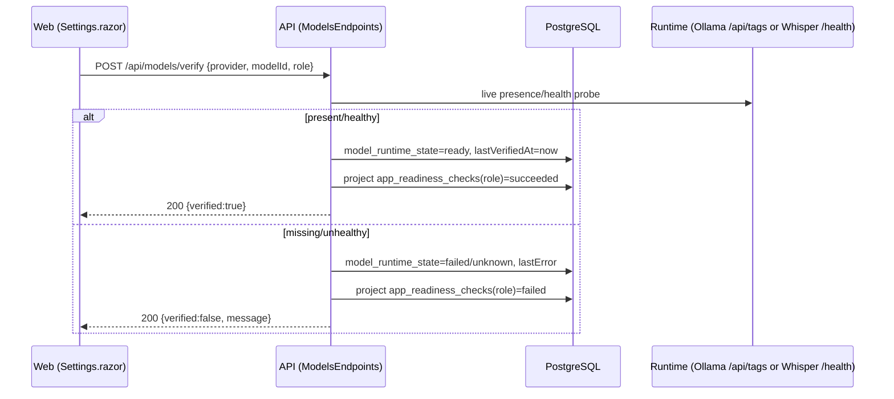
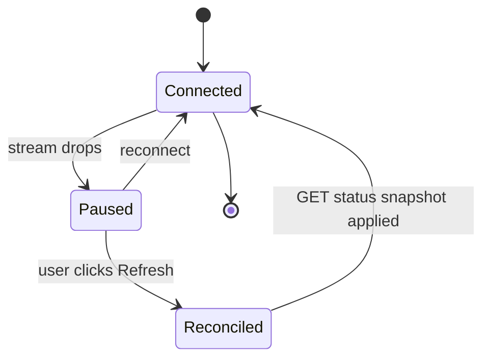
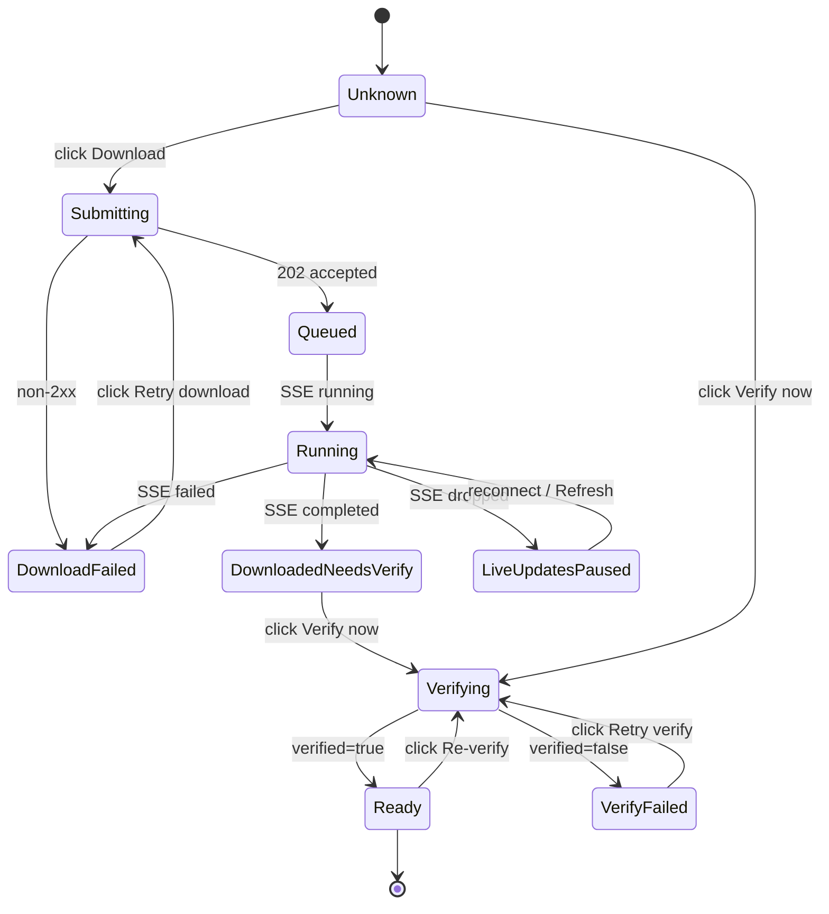
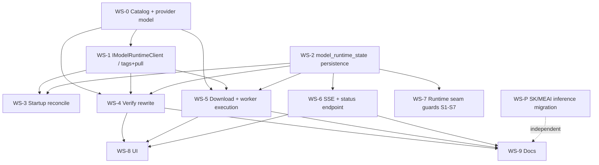

# Model Lifecycle Implementation Plan (Companion)

This is the detailed companion to `model-download-implementation.prompt.md`. That file is the summary brief; this file is the authoritative implementation plan. Read both. Where they differ in detail, this file wins.

Develop this on a **new branch created from current `main`** (for example `feat/model-lifecycle`). Do not build on any in-progress refactor branch.

---

## 1. Problem Statement (Ground Truth)

The admin "Queue download" button does not download anything. `POST /api/models/download` calls `ModelDiscoveryService.QueueDownloadAsync`, which only:

- generates a random `operationId`,
- writes an optimistic `app_readiness_checks` row via `VerifyStepAsync(..., "queued")`,
- returns a `202` with a `statusUrl` that resolves to nothing (no `OperationRecord` is persisted).

`POST /api/models/verify` is equally fake: it marks the readiness step `succeeded` without ever asking the runtime whether the model exists.

The only real model acquisition today is the `ollama-bootstrap` container in `src/StreamingDigest.AppHost/AppHost.cs`, which pulls the two defaults (`bge-m3`, `llama3.1:8b`) once at startup into the `streamingdigest-ollama-data` volume.

The catalog in `src/StreamingDigest.Infrastructure/Persistence/ModelDiscoveryService.cs` also contains **two lies** that must be corrected as part of this work:

- `whisper` is listed with `ollama pull whisper` and family `audio`. The real audio-to-text runtime (`LocalWhisperAudioToTextProvider`) is a **separate whisper HTTP service** (`STREAMINGDIGEST_WHISPER_BASE_URL`), not Ollama. Ollama cannot serve this model to the runtime.

Any plan that only "wires the button to a real pull" is insufficient. We must also make the catalog honest, model provider differences explicitly, and cover every runtime seam that consumes these models.

---

## 2. Objective

Deliver a correct, observable model lifecycle:

1. **Acquire** — real, durable, provider-aware model acquisition initiated from the admin UI.
2. **Store** — into the provider's real storage (Ollama volume today), tracked in app state as source of truth.
3. **Verify** — real presence/health checks against the runtime, not optimistic writes.
4. **Signal** — live progress to the UI via SSE, with manual verify/refresh as an explicit fallback.
5. **Use** — guarantee every primary workflow that consumes a model degrades safely and signals when a required model is missing (per the standing directive: prevent what we can, notify on the rest).

---

## 3. Architecture & Design Decisions

### D1. Durable cross-process handoff = Hangfire; worker-local execution queue = `System.Threading.Channels`

The API and worker are **separate processes**. A raw in-memory `.NET Channel` cannot cross that boundary and would lose work on restart. Decision:

- API persists an `OperationRecord` + a new `model_runtime_state` row, then enqueues a **Hangfire job** (`IBackgroundJobClient.Enqueue`). Hangfire storage already exists in both API and worker (`AddHangfire` / `AddHangfireServer`).
- The worker's Hangfire job handler pushes a `ModelDownloadCommand` into a **bounded `Channel<ModelDownloadCommand>`** owned by a hosted service. That channel is the local execution queue that enforces pull concurrency (default 1) and de-duplicates concurrent requests for the same model.

This satisfies the user's "channel into a background worker" requirement while keeping durability correct.

### D2. Ollama is the source of truth for presence; the DB is the source of truth for status

Never inspect the volume filesystem directly. Use the Ollama HTTP API:

- `GET {ollama}/api/tags` — list installed models (presence).
- `POST {ollama}/api/pull` with `{"model": "...", "stream": true}` — download with streamed progress (`status`, `total`, `completed`).
- `POST {ollama}/api/show` — optional metadata.

Introduce `IModelRuntimeClient` (Application) with an `OllamaModelRuntimeClient` implementation (Infrastructure), sitting beside `OllamaEmbeddingService`. This is the single seam for pull + presence.

### D3. New `model_runtime_state` table is the per-model source of truth; `operations` is the audit/correlation surface; `app_readiness_checks` becomes a downstream projection

Current code overloads `app_readiness_checks` with optimistic writes. Stop that. New responsibilities:

- `model_runtime_state` — current status per (`provider`,`model_id`).
- `operations` (`OperationRecord`) — one row per download/verify action for history + the existing `/api/admin/operations/{id}` status contract.
- `app_readiness_checks` — updated **only** from real verified presence, so onboarding readiness stops lying.

### D4. Provider-aware catalog

Each catalog entry declares a `provider` (`ollama`, `whisper`, `openai`) and a `runtimeRole` (`embedding`, `llm`, `audio`). Only `ollama`-provider models are downloadable through this pipeline in v1. `whisper` and `openai` entries are **verify-only** (probe the external service / API reachability) and must render in the UI as "externally managed," not as a fake pull. This directly fixes the two catalog lies.

### D5. SSE is additive; polling status endpoint remains the fallback

No SSE exists today. Add one API SSE endpoint. The UI subscribes for live patches but the `GET` status endpoints remain authoritative for initial load, reconnect reconciliation, and manual refresh. This matches the existing product rule in `docs/presentation/PRESENTATION.md` (SSE patches loaded views; a gap is closed by a targeted refetch).

### D6. Embedding-model changes are a governed transition, not a casual download

Per ADR-0008 (single active embedding model with declared transition) and ADR-0011 (embedding transition ingestion pause with catch-up): downloading a *new* embedding model does **not** silently switch the active model or invalidate the vector index. Acquiring `nomic-embed-text` or any non-active embedding model must be treated as "available for a declared transition," never an implicit cutover. The plan must not break the dimension guard in `OllamaEmbeddingService` (`STREAMINGDIGEST_EMBEDDING_EXPECTED_DIMENSIONS`) or the pgvector column dimensions.

### D7. Inference standardizes on Microsoft.Extensions.AI; Semantic Kernel orchestrates where it earns it; acquisition uses neither

Model **acquisition** (Sections 1–8) is an Ollama management concern (`/api/pull`, `/api/tags`) and never routes through Semantic Kernel (SK) or Microsoft.Extensions.AI (MEAI) — neither of those downloads or stores models. Model **inference** (runtime seams S1–S7) standardizes on MEAI abstractions (`IChatClient`, `IEmbeddingGenerator`), optionally orchestrated by SK where plugins / function-calling / prompt templates earn it. The `Microsoft.SemanticKernel` package is already pinned in `Directory.Packages.props` but **unused in runtime paths today** — the code uses raw `HttpClient` to Ollama despite the docs claiming SK. Section 12 defines the scope to close that gap. The acquisition workstream (Sections 1–8) and the inference workstream (Section 12) are **decoupled** and can ship independently; the `IModelReadinessGuard` sits at the management seam and is agnostic to the inference stack.

---

## 4. End-to-End Flow

### 4.1 Download sequence

```mermaid
sequenceDiagram
    participant UI as Web (Settings.razor)
    participant API as API (ModelsEndpoints)
    participant DB as PostgreSQL
    participant HF as Hangfire
    participant WK as Worker (ModelDownloadHostedService + Channel)
    participant OL as Ollama (/api/pull, /api/tags)
    participant SSE as API SSE (/api/models/events)

    UI->>API: POST /api/models/download {provider, modelId, role}
    API->>API: validate against provider-aware catalog
    alt provider != ollama
        API-->>UI: 400 (verify-only model, not downloadable)
    else supported ollama model
        API->>DB: upsert model_runtime_state=queued
        API->>DB: insert OperationRecord(status=queued)
        API->>HF: Enqueue(ModelDownloadJob, operationId, modelId)
        API-->>UI: 202 {operationId, statusUrl, status=queued}
        Note over API,SSE: API publishes model.status=queued
        HF->>WK: run ModelDownloadJob
        WK->>WK: push ModelDownloadCommand into bounded Channel
        WK->>DB: model_runtime_state=running; OperationRecord=running
        WK-->>SSE: (via DB change relay) model.status=running
        loop pull progress
            WK->>OL: POST /api/pull stream=true
            OL-->>WK: {status, total, completed}
            WK->>DB: update progress detail
            WK-->>SSE: operation.status progress%
        end
        WK->>OL: GET /api/tags (confirm present)
        alt present
            WK->>DB: model_runtime_state=ready; OperationRecord=completed
            WK->>DB: project app_readiness_checks(role)=succeeded
            WK-->>SSE: model.status=ready / operation.completed
        else pull failed or not present
            WK->>DB: model_runtime_state=failed; OperationRecord=failed(error)
            WK->>WK: emit notification (Matrix path) per prevent/notify directive
            WK-->>SSE: model.status=failed / operation.failed
        end
    end
```

### 4.2 Manual verify sequence



### 4.3 SSE reconnect reconciliation



---

## 5. Data Model

### 5.1 New table `model_runtime_state`

| column | type | notes |
| --- | --- | --- |
| `id` | uuid PK | |
| `provider` | text | `ollama` \| `whisper` \| `openai` |
| `model_id` | text | e.g. `bge-m3`, `llama3.1:8b` |
| `runtime_role` | text | `embedding` \| `llm` \| `audio` |
| `status` | text | `unknown` \| `queued` \| `running` \| `verifying` \| `ready` \| `failed` |
| `current_operation_id` | uuid null | FK-ish to `operations.id` |
| `progress_percent` | int null | last streamed pull progress |
| `last_verified_at` | timestamptz null | last real presence confirmation |
| `last_seen_in_runtime_at` | timestamptz null | last `/api/tags` hit |
| `last_error_summary` | text null | |
| `details_json` | jsonb null | pull/probe metadata |
| `updated_at` | timestamptz | |

Unique index on (`provider`, `model_id`). Create it via a `PostgresMigrationRunner` migration consistent with existing migration conventions, and via an `EnsureSchemaAsync` guard consistent with `AppReadinessStateService`.

### 5.2 Reuse `OperationRecord`

Use `operation_type = "model.download"` / `"model.verify"`, `related_entity_type = "model"`, and store the model id in `SummaryJson`. This keeps the existing `/api/admin/operations/{id}` contract working for the status URL the UI already receives.

---

## 6. API Surface

| method + path | change | contract |
| --- | --- | --- |
| `GET /api/models/options` | extend | add `provider`, `runtimeRole`, `downloadable`, and current `state` snapshot per model |
| `POST /api/models/download` | rewrite | validate → persist operation + state → enqueue Hangfire → `202 {operationId, statusUrl, status}`; reject non-`ollama` providers with `400` + actionable message |
| `POST /api/models/verify` | rewrite | real runtime probe; update state + readiness projection; return `{verified, message}` |
| `GET /api/models/status` | add | snapshot of all `model_runtime_state` rows for initial load + reconnect reconciliation |
| `GET /api/models/events` | add | SSE (`text/event-stream`) emitting `model.status`, `operation.status`, `operation.completed`, `operation.failed` |
| `GET /api/admin/operations/{id}` | reuse | already exists; now actually backed for model ops |

SSE implementation notes: keep it WASM-friendly (native `EventSource` semantics — GET, no custom headers required beyond auth cookie), honor the existing auth middleware in `ApiRequestPipeline`, and drive events from persisted state changes (a lightweight in-process broadcaster that the download job and verify endpoint publish to), not from controller-local memory.

---

## 7. UI Changes (Concrete)

File: `src/StreamingDigest.Web/Pages/Settings.razor` (+ a small `ModelDownloadClient`/state service).

Replace the current page-global `_isBusy` + single `_statusMessage` model with **per-row state**. Today one click disables every row and the only "success" is an HTTP 200.

### 7.1 Per-model row state machine



### 7.2 Row rendering rules

| state | badge | primary CTA | secondary |
| --- | --- | --- | --- |
| `Unknown` | Not checked | Download (ollama) / Verify (external) | Verify now, Refresh |
| `Submitting` | Starting… | (disabled) | — |
| `Queued` | Queued | Refresh | View status |
| `Running` | Downloading N% | Refresh | View status |
| `DownloadedNeedsVerify` | Downloaded | Verify now | Refresh |
| `Verifying` | Verifying | (disabled) | Refresh |
| `Ready` | Ready | Re-verify | Refresh |
| `DownloadFailed` | Download failed | Retry download | Refresh, show error |
| `VerifyFailed` | Not ready | Retry verify | Download, Refresh |
| `LiveUpdatesPaused` | prior badge + "Live updates paused" | Refresh | — |

### 7.3 Page-level surfaces

- Connection strip: `Live updates connected` / `Reconnecting…` / `Live updates paused` + `Refresh all`.
- Active-operations count: `N model operations in progress`.
- **Non-ollama models** (`whisper`) render with a "Managed externally" hint and expose only **Verify now** — no fake Download button.
- First positive acknowledgement copy after a click must read `Queued for download` / `Download request accepted`, never `Downloaded`.

---

## 8. Runtime-Usage Seam Scan (All Primary Workflows)

This is the part the summary prompt omits. For each seam, the plan must add a **preflight guard + notification** so a missing/unready model is prevented where possible and signaled otherwise. Do not silently 500 or silently degrade.

| # | Workflow use case | Model + role | Seam (code) | Consumer path | Required guard/behavior |
| --- | --- | --- | --- | --- | --- |
| S1 | Ingestion → search indexing | embedding (`bge-m3`) | `IEmbeddingService` → `OllamaEmbeddingService` | `PostgresSearchDocumentEmbeddingStore`, `SearchDocumentRegenerationService` | Before indexing, confirm active embedding model is `ready`; if not, mark documents `embedding_status=deferred` and notify, don't hard-fail the run |
| S2 | Search query embedding | embedding (`bge-m3`) | `OllamaEmbeddingService` | `PostgresRecentSearchStore`, `SearchUiService.SearchAsync` | If embedding model unready, degrade to the existing "corpus warming"/no-embedding path and surface a clear reason, not a raw exception |
| S3 | Cluster aggregates | embedding | `IVideoClusterEmbeddingStore` → `PostgresVideoClusterEmbeddingStore` | video cluster build | Same readiness gate as S1; skip + notify when unready |
| S4 | Transcript semantic refinement | llm (`llama3.1:8b`) | `DeterministicTranscriptChunkingService` (`/api/chat`) | segment generation | Already best-effort (falls back to deterministic chunks). Add a one-time notification when the LLM is unreachable/unready so it is not silent |
| S5 | Link / resource classification | llm | `LinkClassificationService` | enrichment | Preflight LLM readiness; on unready, use existing heuristic fallback + notify |
| S6 | Audio-to-text transcription | whisper (external service, **not ollama**) | `IAudioToTextProvider` → `LocalWhisperAudioToTextProvider` | `TranscriptIngestionService` | Verify whisper service reachability (`/health`); if unconfigured/unreachable, keep the existing stub/deferral path and notify. Fix the catalog so whisper is `provider=whisper`, verify-only |
| S7 | Embedding health test (admin) | embedding | `AdminOperationsService.TestEmbeddingServiceAsync` | admin "test embeddings" | Route through the same `IModelRuntimeClient` presence check for consistency |
| S8 | Embedding model transition | embedding | dimension guard `STREAMINGDIGEST_EMBEDDING_EXPECTED_DIMENSIONS` + pgvector columns | ADR-0008 / ADR-0011 | Acquiring a non-active embedding model must NOT switch the active model or invalidate the index; expose it as "available for declared transition" only |
| S9 | Onboarding readiness | embedding/llm/audio | `AppReadinessStateService` steps `embedding_model_verified`, `llm_model_verified`, `audio_to_text_verified` | onboarding wizard + dashboard | These steps must be projected from **real** verify results, replacing today's optimistic writes |
| S10 | First-run / fresh install | all defaults | `ollama-bootstrap` in `AppHost.cs` | startup | Bootstrap remains the baseline acquire path; the app must reconcile bootstrap-installed models into `model_runtime_state=ready` on startup so the UI is truthful without a manual verify |

Deliverable for this section: a small shared `IModelReadinessGuard` (Application) used by S1–S7 that answers "is model X for role Y ready right now?" from `model_runtime_state`, plus a single notification helper reused across seams. No seam should re-implement its own probe.

---

## 9. Workstreams, Sequencing & Parallelization

Work is organized into workstreams (WS). Foundations are strictly sequential; most feature workstreams parallelize once foundations land. **WS-P (Section 12, SK/MEAI inference) is fully independent and can run in parallel from day one.** Every workstream carries its own test gate: no workstream merges without its Integration tier green, and no lifecycle workstream merges without its E2E slice green. Section 10 defines the shared tiers + volume isolation those gates must satisfy.

### 9.1 Dependency graph



### 9.2 Phase 0 — Foundations (sequential)

- **WS-0 Catalog + provider model.** Extend `ModelOptionDefinition` with `provider`, `runtimeRole`, `downloadable`; ensure embedding and LLM catalog entries are honest about Ollama downloads, and keep `whisper` as verify-only.
  - Tests — Unit: catalog validation, non-ollama marked non-downloadable. Integration: `GET /api/models/options` returns provider/role/downloadable. E2E: deferred to WS-5.
- **WS-1 `IModelRuntimeClient` + `OllamaModelRuntimeClient`.** `/api/tags`, `/api/pull` (streamed), `/api/show`.
  - Tests — Unit: tags/pull JSON parsing with mocked `HttpClient`. Integration: against a throwaway Ollama container, `tags` lists installed models. E2E: via WS-5.
- **WS-2 `model_runtime_state` persistence.** Migration + `EnsureSchemaAsync` + repository.
  - Tests — Unit: repo mapping. Integration: Postgres container — schema ensure, upsert, unique index on (`provider`,`model_id`). E2E: n/a.

### 9.3 Phase 1 — Lifecycle (parallel after Phase 0)

WS-3, WS-4, WS-6, WS-7 proceed concurrently; WS-5 is the largest and internally sequential.

- **WS-3 Startup reconcile.** Hydrate `model_runtime_state` from `/api/tags` on API/worker startup so bootstrap models show `ready` (covers S10). Depends: WS-1, WS-2.
  - Tests — Unit: reconcile mapping. Integration: Postgres + stub/real tags → pre-present models become `ready`. E2E: covered by WS-5 fresh-install path.
- **WS-4 Verify rewrite.** Real probe, update state, project readiness (covers S7, S9). Depends: WS-0, WS-1, WS-2.
  - Tests — Unit: readiness projection (present/missing). Integration: Postgres + stubbed runtime → state + `app_readiness_checks` reflect the probe. E2E: verify step inside the WS-5 e2e.
- **WS-5 Download + worker execution (internally sequential).** API durable handoff (`202` only after persist + Hangfire enqueue) → worker Hangfire job → bounded `Channel<ModelDownloadCommand>` hosted service → streamed pull → state/operation transitions → notify on failure. Depends: WS-0, WS-1, WS-2.
  - Tests — Unit: worker state machine (`queued→running→ready`, `→failed`), dedup, bounded-channel concurrency. Integration: Postgres + Hangfire — `202` only after persist + job enqueued; worker transitions against a stubbed runtime. **E2E (real Ollama, isolated volume): download a small model → present in `/api/tags` → `verify` returns true.**
- **WS-6 SSE + status endpoint.** `GET /api/models/events` (in-process broadcaster fed by state changes) + `GET /api/models/status`. Depends: WS-2 (can develop against the state table before WS-4/WS-5 land).
  - Tests — Unit: broadcaster emits one ordered event per subscriber. Integration: SSE endpoint emits the expected event sequence for a simulated lifecycle; auth enforced by `ApiRequestPipeline`. E2E: live transitions observed in the WS-8 e2e.
- **WS-7 Runtime seam guards (S1–S7).** `IModelReadinessGuard` + shared notification helper wired across the seams in Section 8. Depends: WS-2.
  - Tests — Unit: guard readiness logic; each seam's fallback fires + notifies when unready. Integration: Postgres + unready embedding model → search query degrades (not 500) and ingestion indexing defers. E2E: model-missing search path exercised end to end.

### 9.4 Phase 2 — Surface + docs

- **WS-8 UI.** Per-row state machine, SSE subscription, manual verify/refresh, external-model rendering. Depends: WS-4, WS-5, WS-6 (can start against the fixed SSE/status contracts).
  - Tests — Unit/component: row state-machine transitions. **E2E (Playwright, isolated volume): queue→downloading%→downloaded→ready, manual verify, external-model rendering, SSE-paused→refresh reconcile.**
- **WS-9 Docs.** Update `docs/api/API_SPEC.md` (endpoints + SSE) and `docs/presentation/PRESENTATION.md` (real download UX); README catalog description. Depends: contract-affecting workstreams (WS-4/5/6) and, if included, WS-P.
  - Tests — docs build/lint; verify examples match the shipped contracts.

### 9.5 Independent parallel stream

- **WS-P SK/MEAI inference migration (Section 12).** Fully decoupled from WS-0..WS-9 — acquisition vs inference are separate seams. Can start immediately and merge on its own cadence. Carries its own Unit/Integration/E2E/Regression gate (Section 12.7).

### 9.6 Parallelization summary

| can run in parallel | why |
| --- | --- |
| WS-3, WS-4, WS-6, WS-7 | depend only on foundations (WS-1/WS-2), not on each other |
| WS-5 alongside WS-3/4/6/7 | shares foundations; worker path is internally sequential but externally independent |
| WS-P alongside everything | acquisition vs inference are separate seams |

Foundations (WS-0/1/2) must land first and in order. WS-8 waits on the WS-4/5/6 contracts. WS-9 closes each contract-affecting workstream.

---

## 10. Cross-Cutting Test Strategy & Isolation

Every workstream in Section 9 carries its own Build/Unit + Integration + E2E gate; this section defines the shared tiers, harness anchors, and isolation rules those gates must satisfy. No workstream merges without its Integration tier green; no lifecycle workstream (WS-3..WS-8) and no inference workstream (WS-P) merges without its E2E slice green. The bullets below are the consolidated view of the per-workstream tests declared in Section 9.

### 10.1 Unit (no containers)

- Catalog: unsupported model rejected; non-ollama provider marked non-downloadable.
- `download`: does **not** return success if operation/state persistence fails.
- Worker state machine: `queued → running → ready` and `queued → running → failed` transitions, including duplicate-command de-dup and bounded-channel concurrency.
- `/api/tags` parsing → presence mapping in `OllamaModelRuntimeClient` (mocked `HttpClient`).
- `verify` projection: readiness step reflects probe result (success and failure).
- SSE broadcaster: a state change produces exactly one ordered event per subscriber.
- `IModelReadinessGuard`: returns unready for missing model and gates each seam's fallback.
- Anchor/extend: `ModelDiscoveryServiceTests`, `AdminOperationsServiceTests`, `AppReadinessStateServiceTests`.

### 10.2 Integration (Postgres container; Ollama optional/mocked)

- `POST /api/models/download` persists `OperationRecord` + `model_runtime_state=queued` and enqueues a job before returning `202`.
- `GET /api/models/status` and `/api/admin/operations/{id}` reflect persisted state.
- `verify` against a stubbed runtime updates state + readiness.
- SSE endpoint emits the expected event sequence for a simulated lifecycle.
- Startup reconcile marks pre-present models `ready`.

### 10.3 End-to-end (real Ollama + Postgres + API + worker)

Full slice: start Postgres, start a **dedicated Ollama container**, start API + worker, `POST /api/models/download` for a small real model, wait for `operation.completed`, assert the model is actually present via `/api/tags`, then `POST /api/models/verify` and assert `verified:true`. Follow the process-oriented harness style of `tests/StreamingDigest.E2E/FirstRunSetupE2ETests.cs`.

### 10.4 Test-time volume isolation (MANDATORY)

- E2E/integration Ollama containers must mount a **unique per-run Docker volume** such as `streamingdigest-it-ollama-{guid}` at `/root/.ollama`.
- Never reuse `streamingdigest-ollama-data` (the app volume). Tests must never pull into, mutate, or read the developer's real model store.
- Delete the test volume in teardown (`docker volume rm`), best-effort, with the volume name derived once and reused so cleanup is deterministic.
- Prefer the smallest viable real model for the pull assertion to keep E2E runtime bounded; if size is a concern, gate the real-pull E2E behind an opt-in trait and keep a stubbed-runtime integration test in the default suite.
- Update the existing `ApiContractConformanceTests` so it stops asserting the old fake verify/download behavior.

---

## 11. Validation Before You Finish

- Run the targeted unit + integration tests for every touched slice, and the E2E model-download slice.
- Manually validate against the running Aspire app: queue a supported model, watch the row move `Queued → Downloading% → Downloaded → Ready` via SSE, force a failure (bad model id) and confirm `DownloadFailed` + notification, then confirm a required-model-missing workflow (e.g. search) degrades with a clear signal rather than a 500.
- Confirm every E2E/integration model test used a distinct volume from `streamingdigest-ollama-data`.
- Confirm `app_readiness_checks` is only written from real verification.
- Confirm no unrelated files changed.

## 12. Semantic Kernel & Microsoft.Extensions.AI Integration Scope

This section makes the documented-but-unimplemented Semantic Kernel commitment real and standardizes all model **inference** on Microsoft.Extensions.AI. It is a decoupled companion to Sections 1–11 (acquisition/lifecycle), not a prerequisite.

### 12.0 Boundary (read first)

- **Acquisition/lifecycle (Sections 1–8): never SK/MEAI.** Pull, store, presence-check, and verify are Ollama *management* concerns (`/api/pull`, `/api/tags`). SK and MEAI are *inference* abstractions and cannot acquire models. `IModelRuntimeClient` stays a thin management client.
- **Inference (seams S1–S7): standardize on MEAI, orchestrate with SK where it adds value.** Today these seams use raw `HttpClient` to Ollama `/api/embeddings` and `/api/chat`, despite `docs/architecture/ARCHITECTURE.md`, `docs/product/PRD.md`, and `README.md` stating Semantic Kernel. This section closes that gap.
- `IModelReadinessGuard` (Section 8) stays at the management seam, so "model present" and "inference works" remain separable regardless of the inference stack.

### 12.1 Target abstractions

- **Embeddings** → `Microsoft.Extensions.AI.IEmbeddingGenerator<string, Embedding<float>>`, replacing `IEmbeddingService` / `OllamaEmbeddingService`.
- **Chat/LLM** → `Microsoft.Extensions.AI.IChatClient`, replacing the raw `/api/chat` calls in `DeterministicTranscriptChunkingService` and `LinkClassificationService`.
- **Orchestration** → Semantic Kernel `Kernel` built over those MEAI clients, used **only** where plugins / function-calling / prompt-template management earn their weight (initially transcript refinement and link classification). Simple one-shot calls use MEAI directly without a full `Kernel`.
- **Audio-to-text** → **stays behind the existing `IAudioToTextProvider`.** MEAI has no stable audio-to-text abstraction in the pinned versions and SK's is experimental. Optionally align the provider signature to SK's audio-to-text service shape (the docs already hedge "`AudioToTextClientBase` where compatible"), but do not block on it.

### 12.2 Packages (CPM)

Add to `Directory.Packages.props` (pin versions to the .NET 10 line, consistent with the rest of the repo):

- `Microsoft.Extensions.AI` + `Microsoft.Extensions.AI.Abstractions` — GA. `Abstractions` provides `IChatClient` and `IEmbeddingGenerator<TInput,TEmbedding>`; `Microsoft.Extensions.AI` provides the middleware (`UseFunctionInvocation`, `UseOpenTelemetry`, `UseDistributedCache`, `UseLogging`).
- **Ollama provider: prefer `OllamaSharp` v4.** Per Microsoft Learn, OllamaSharp 4 implements the MEAI interfaces directly — `new OllamaApiClient(new Uri("http://host:11434/"), "model")` **is** an `IChatClient` and an `IEmbeddingGenerator`. It is GA and needs no experimental pragma.
- `Microsoft.SemanticKernel` 1.78 is already pinned (dormant today). Only add `Microsoft.SemanticKernel.Connectors.Ollama` if you use SK's own Ollama connector — note it is **experimental** and requires `#pragma warning disable SKEXP0070`. Prefer wiring OllamaSharp as the MEAI client and building the SK `Kernel` over it, avoiding the experimental surface.

### 12.3 DI registration (API + Worker)

Register once and share via the MEAI builder pipeline so cross-cutting concerns are uniform. Use the current builder API (`.AsBuilder()` on the OllamaSharp client):

- Embeddings: `IEmbeddingGenerator<string, Embedding<float>>` = `new OllamaApiClient(endpoint, embeddingModel).AsBuilder().UseOpenTelemetry(...).UseLogging().Build()` (optionally `.UseDistributedCache()`).
- Chat/LLM: `IChatClient` = `new OllamaApiClient(endpoint, llmModel).AsBuilder().UseFunctionInvocation().UseOpenTelemetry(sourceName: "Experimental.Microsoft.Extensions.AI").UseLogging().Build()`.
- Tool/plugin calling uses `AIFunctionFactory` + `FunctionInvokingChatClient` (via `.UseFunctionInvocation()`); build the SK `Kernel` from the same `IChatClient` rather than a second connector stack.
- **Wire the MEAI OTel source into the existing pipeline**: add ActivitySource/meter `Experimental.Microsoft.Extensions.AI` to the OpenTelemetry `WithTracing`/`WithMetrics` config in `Program.cs` (API and Worker) so GenAI chat/token spans reach the existing OTel collector alongside `CorrelationContext.ActivitySourceName`.
- If you use SK's embedding connector instead of OllamaSharp, note SK has **replaced** `ITextEmbeddingGenerationService` with `IEmbeddingGenerator` (`AddOllamaEmbeddingGenerator`; resolve `IEmbeddingGenerator<string, Embedding<float>>` from the kernel). The legacy service is obsolete.
- Endpoint/model config keeps resolving from the keys `OllamaEmbeddingService` already reads (`STREAMINGDIGEST_EMBEDDING_MODEL`, `STREAMINGDIGEST_LLM_MODEL`, `llm:baseUrl`, `OLLAMA_HOST`, etc.), so there is no config-surface regression.

### 12.4 Seam migration mapping

| seam | current | target |
| --- | --- | --- |
| S1/S2/S3 embeddings | `IEmbeddingService.GenerateEmbeddingAsync` (raw HTTP) | `IEmbeddingGenerator.GenerateAsync`; keep the dimension guard (D6/S8) and pgvector `Vector` conversion |
| S4 transcript refinement | raw `/api/chat` in `DeterministicTranscriptChunkingService` | `IChatClient` (optionally SK prompt + JSON-schema response format) |
| S5 link classification | raw `/api/chat` in `LinkClassificationService` | `IChatClient` (SK function-calling if structured output helps) |
| S6 audio-to-text | `LocalWhisperAudioToTextProvider` (raw HTTP) | abstraction unchanged; optional SK audio-interface alignment |
| S7 embedding health test | `AdminOperationsService.TestEmbeddingServiceAsync` | call through `IEmbeddingGenerator` for parity |

### 12.5 Constraints

- Preserve behavior and outputs: embedding dimensions, the JSON-schema refinement contract, and the deterministic/heuristic fallbacks (S4/S5 must still degrade to non-LLM paths and notify).
- Keep readiness at the management seam (`/api/tags`), not inside the MEAI client.
- No SSR/SignalR; SK/MEAI live only in Application/Infrastructure + API + Worker.
- Migrate one seam at a time behind the existing interfaces; delete `OllamaEmbeddingService` only after `IEmbeddingGenerator` is proven at parity.

### 12.6 Phasing (independent of Sections 1–8)

1. Add packages + shared MEAI DI (`IChatClient`, `IEmbeddingGenerator`) with OpenTelemetry + logging middleware.
2. Migrate embeddings (S1/S2/S3/S7); assert dimension + pgvector parity.
3. Migrate chat seams (S4/S5) to `IChatClient`; keep deterministic/heuristic fallbacks.
4. Introduce SK `Kernel` + plugins only where prompt/function-calling complexity justifies it.
5. Update `docs/architecture/ARCHITECTURE.md`, `docs/product/PRD.md`, and `README.md` so "Semantic Kernel" reflects reality.

### 12.7 Tests

- Unit: mock `IChatClient` / `IEmbeddingGenerator`; assert embedding-dimension parity and chat JSON-contract parity vs the current raw-HTTP behavior; assert fallbacks still fire when the client throws.
- Integration: real Ollama container (isolated volume per Section 10.4) behind the MEAI clients — one embedding call (dimension + pgvector parity) and one chat call (JSON-contract parity).
- E2E: with the MEAI generator wired in, run one real ingestion→index→search slice and assert results are unchanged vs the raw-HTTP baseline.
- Regression: existing `OllamaEmbeddingService`-shaped tests must pass against the MEAI-backed generator **before** the old service is removed.

### 12.8 Microsoft Learn references (verified current)

- Microsoft.Extensions.AI overview + packages (`IChatClient`, `IEmbeddingGenerator<TInput,TEmbedding>`, middleware): `learn.microsoft.com/dotnet/ai/microsoft-extensions-ai`.
- `IChatClient` usage, functionality pipelines, tool calling (`AIFunctionFactory`, `FunctionInvokingChatClient`, `.UseFunctionInvocation()`): `learn.microsoft.com/dotnet/ai/ichatclient`.
- `IEmbeddingGenerator` usage + delegating pipelines: `learn.microsoft.com/dotnet/ai/iembeddinggenerator`.
- OllamaSharp 4 implements the MEAI interfaces (`new OllamaApiClient(uri, model)` is an `IChatClient`/`IEmbeddingGenerator`): `learn.microsoft.com/dotnet/aspire/compatibility/9.0/ollama-integration-updates`.
- SK moved off `ITextEmbeddingGenerationService` to `IEmbeddingGenerator` (`AddOllamaEmbeddingGenerator`; resolve `IEmbeddingGenerator<string, Embedding<float>>` from the kernel): `learn.microsoft.com/semantic-kernel/support/migration/text-embedding-obsolete-migration-guide`.
- SK C# packages incl. `Microsoft.SemanticKernel.Connectors.Ollama` (experimental, SKEXP0070): `learn.microsoft.com/semantic-kernel/get-started/supported-languages`.
- OTel GenAI spans via `.UseOpenTelemetry(sourceName: "Experimental.Microsoft.Extensions.AI")`: `learn.microsoft.com/dotnet/api/microsoft.extensions.ai.opentelemetrychatclient`.

---

## 13. Deliverable

A PR-ready branch off `main` implementing acquire + store + verify + signal + guarded runtime usage across S1–S10, with unit/integration/E2E coverage and isolated test volumes. Where scope includes the inference migration, standardize model inference on Microsoft.Extensions.AI (`IChatClient`, `IEmbeddingGenerator`) with Semantic Kernel orchestration per Section 12, and update the architecture/PRD/README docs so the Semantic Kernel claim is accurate. Docs elsewhere are updated only where the contract changed.
